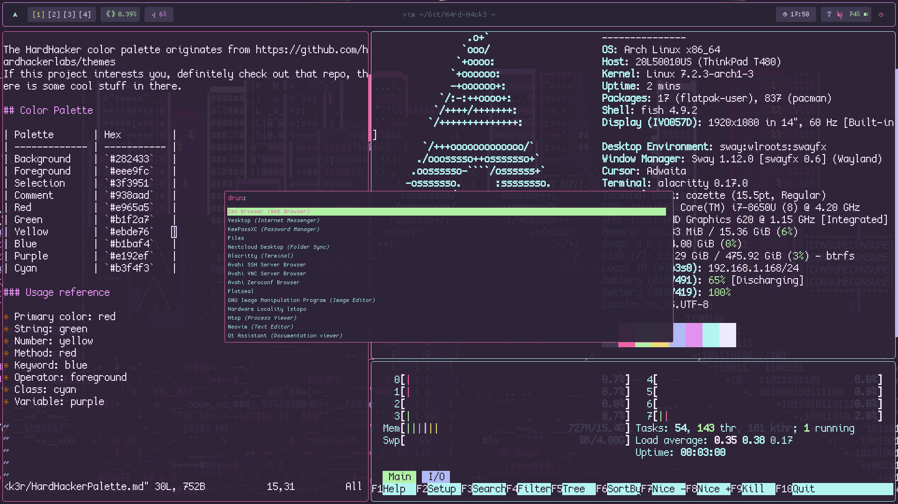

# H4rd-H4ck3r

This is a collection of dotfiles for r0s3le's H4rd-H4ck3r rice.
The config is still a work in progress, and will be added to after a few iterations..

## Showcase

## Dependencies 

* swayfx/sway
* swaylock
* swayidle
* waybar
* rofi
* alacritty
* grim
* pulsemixer
* CozetteCrossedSeven https://github.com/the-moonwitch/Cozette

Note: without using xdg-desktop-portal* packages, you will not have a good experience.

## Installation

In the `HOME/config/` portion of this project are the main files for this project. Installing them to your `~/.config` (Or whatever directory handles your configurations) directory **SHOULD** make most of the changes take effect after reloading the window manager, but for all changes to be properly applied a reboot may be needed.Similarly, there are `HOME/swaylock/`, and `HOME/themes` directories of which, the contents should be moved to their respective `.<dir>` directories.

This setup assumes that the XDG_CONFIG_HOME environment variable is set to your config directory ie `~/.config`. This can be checked with `echo $XDG_CONFIG_HOME`.

To install this environment and overwrite your current config run, 

`git clone https://github.com/r0s3le/H4rd-H4ck3r`
`cd H4rd-H4ck3r`
`cp -u HOME/config/* $HOME/.config/`
`cp -u HOME/swaylock/* $HOME/.swaylock/`
`cp -ru HOME/themes/* $HOME/.themes/`
`gsettings set org.gnome.desktop.interface gtk-theme H4rd-H4ck3r`

then reboot.
**THIS WILL OVERWRITE YOUR CONFIG**
Make a backup if youd like to keep it.

## Aspiratons 

Ideally, this project will come packaged with a script for easy installation and perhaps some different options depending on screen DPI. Maybe down the line it will get some nix flakes, but for now it will be focused mainly on Arch.

  
